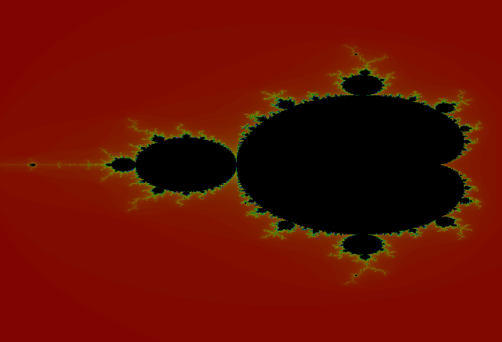
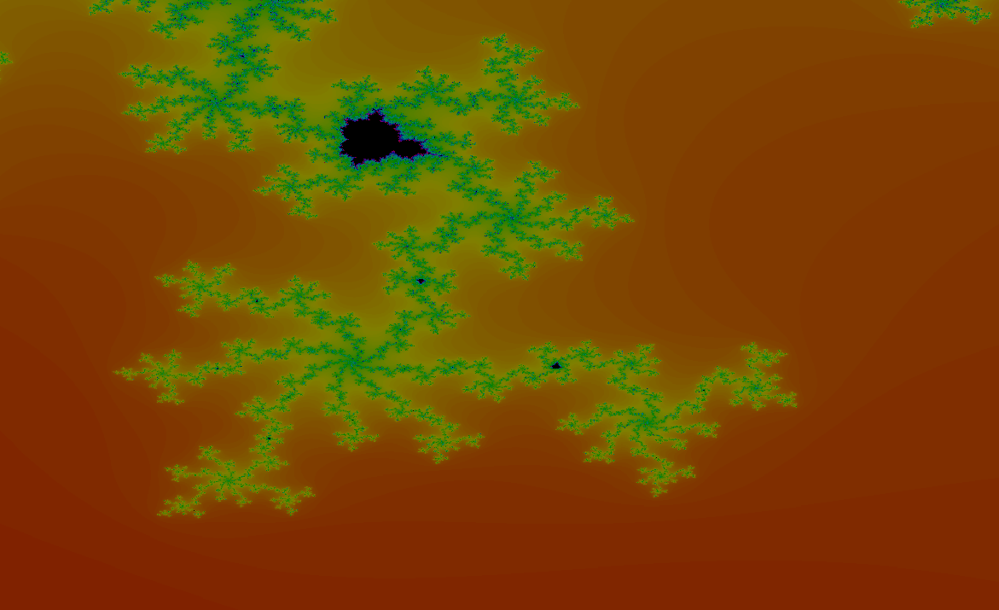

![GitHub commit activity][updates-monthly]
![Last Commit][last-commit]
![License][license]

  
    <h3 align="center">fractolio</h3>

## About The Project

**fractolio** is supposed to be a small, free, efficient and highly customizable tool
to explore 2 dimensional fractals.
Such as colorful visualized Plots of Julia Sets, of the Mandelbrot Set in special and many more to come.
The Creation of this tool started with the motivation to learn more about efficient computing and the visualisation
of fractals.

## Built with

* JavaFx
* Maven

## Getting started

soon to be added

## Installation

soon to be added

## License

Distributed under the MIT License. See `LICENSE.txt` for more information.

<!-- Markdown-Links -->
[last-commit]: https://img.shields.io/github/last-commit/romanamo/fractolio
[updates-monthly]: https://img.shields.io/github/commit-activity/m/romanamo/fractolio
[license]: https://img.shields.io/github/license/romanamo/fractolio

## Gallery

